# 📅 2026-04-29 - 자료구조

## 📚 상세 학습 내용

### １. 자료구조(data structure)

- 컴퓨터에서 자료들을 정리하고 조직화 하는 여러가지 구조
  - 자료마다 효율적인 정리 규칙이 존재트리, 그래프
  - 단순 자료 구조 : 숫자, 문자
  
- 복합 자료 구조
  - 선형(linear) 자료구조
  - 자료들을 일렬로 나열(순서)
  - 리스트, 스택, 큐, 덱
  - 비선형(non-linear) 자료구조
    - 한 줄로 나열하기 어려운 자료들
    - 트리, 그래프
  
---

### 2. 알고리즘(algorithm)

- 문제를 해결하기 위한 절차/방법/명령어모음
  - 프로그램 = 자료구조 + 알고리즘
  - 프로그램 언어와는 무관

- 알고리즘 조건
  - 입력 : 0개 이상 존재
  - 출력 : 1개 이상 존재
  - 명백성 : 명령어의 의미는 모호하지 않고 명확
  - 유한성 : 유한한 단계 후에는 반드시 종료
  - 유효성 : 명령어들은 실행 가능한 연산

- 알고리즘 기술 방법
  - 자연어
  - 흐름도(flowchart)
  - 유사코드(psudo-code)
  - 프로그래밍언어

---
- 이미지 예

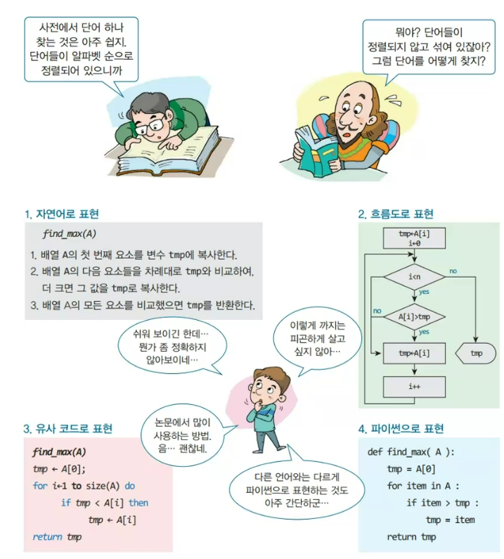

---

### 3.추상 자료형(Abstract Data Type, ADT)

- 추상적으로 정의한 자료형
  - 핵심적인 구조, 동작에만 집중
  - 제공되는 자료, 연산만 정의 (what)
  - 구현 방법은 정의하지 않음 (How)

- 인터페이스(interface)만 공개
  - 정보은닉(information hiding)

- 클래스로 구현하는 것이 더 적합함

---
### 4. 알고리즘 성능

 - 계산속도, 메모리 사용량, 기능 달성도
  - 계산속도 우선시 하는 경향이 있음
- 시간 측정 어려움
  - 구현 필수
  - 동일한 조건의 하드웨어 사용
  - 동일한 소프트웨어 환경
    - 구현 언어(컴파일 언어 > 인터프리터 언어)
  - 데이터에 따른 가변성  
---

  

---

### 4. 알고리즘 성능 : 복잡도 분석(complexity analysis)

- 실제 구현 없이 알고리즘의 효율성 분석
  - 알고리즘의 연산 횟수를 대략적으로 계산
  - 하드웨어, 소프트웨어 환경에 무관한 평가 방법
  - 입력 개수 𝑛이 증가함에 따라 실행시간/필요한 메모리의 증가 형태 분석
- 알고리즘을 구성하는 연산 횟수 분석
  - 시간복잡도 함수 𝑇(𝑛) : 연산의 수를 𝑛의 함수로 표현

---

### 5. 알고리즘 성능 : 복잡도 분석(complexity analysis) - 1

- 점근적 표기(Asymptotic notation)
  - 계수 없이 최고차항만으로 단순하게 표현하는 방법
    - 입력 계수가 증가할 수록 계수, 최고차항 이외의 항의 영향이 크게 줄어듦
  - 연산의 증가속도 표현

---

### 6. 알고리즘 성능 : 복잡도 분석(complexity analysis) - 2

- 빅오표기법
  - 함수의 상한을 표시

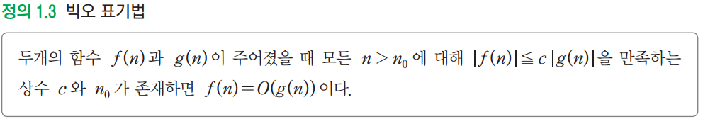

- 최소 차수 함수로 표기되었을 경우에 유의미함
  - 단점 : 상한이 여러 개 존재할 수 있음

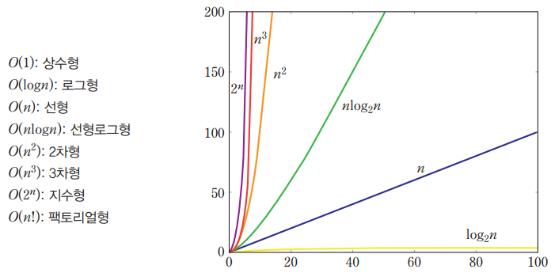

---

### 6. 알고리즘 성능 : 복잡도 분석(complexity analysis) - 3

- 빅오메가(big omega)
  - 함수의 하한을 표시

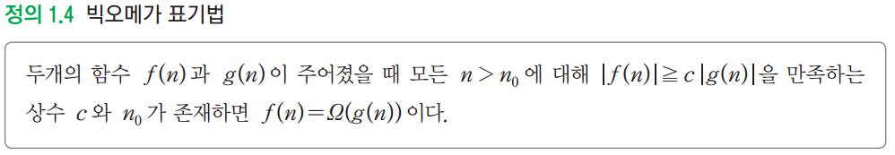

- 빅세타(big theta)
  - 동일한 함수로 상한과 하한을 표시

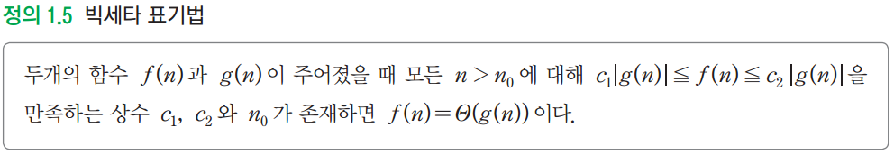
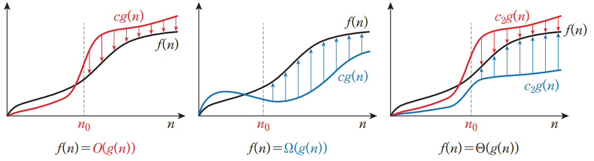

---

### 7. 알고리즘 성능 : 입력 데이터

- 입력 데이터에 의해 실행 시간 상이
  - 최선의 경우(best case), 평균의 경우(average case), 최악의 경우(worst case)
  - 최악의 경우에 대한 실행 시간이 중요
    - 비행기 관제, 게임, 로보틱스

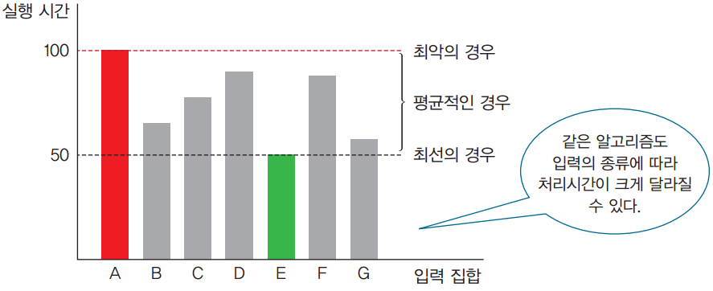

---

### 8. 리스트(list) / 선형 리스트(linear list)

- 항목들이 차례대로 나열되어 있는 선형 자료
  - 항목은 순서/위치(position)을 가짐
- 임의의 위치에 항목의 삽입 및 추가 가능
- 리스트 vs 집합(set)
  - 항목들 사이의 순서 여부

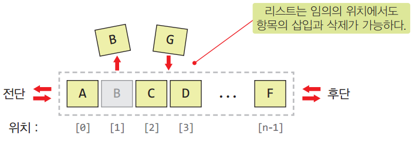
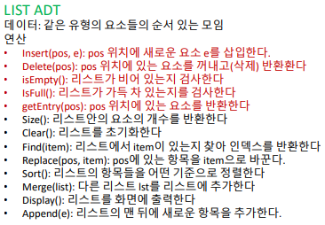

---

### 9. 리스트 구현 방식 - 1

- 배열(array) 구조
  - 같은 자료형의 데이터를 한꺼번에 만들 때 사용
  - 인덱스 연산자 [ ] 사용
  - 항목들이 메모리의 연속된 공간에 위치
    - 항목 접근의 시간 복잡도 𝑂 1
  - 용량 변경 어렵고, 배열의 중간에 대한 연산(데이터 추가 및 삭제, 수정 등)이 비효율적

- 연결된 구조(linked structure)
  - 링크를 이용해 다음 항목의 위치만 인지
  - 항목들이 메모리의 인접한 위치에 있다는 보장 불가
    - 항목 접근의 시간 복잡도 𝑂 𝑛
  - 용량 변경이 용이하고, 삽입, 삭제 효율적

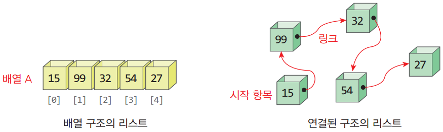

---

### 9. 리스트 구현 방식 - 2

- 프로그래밍 언어마다 리스트 구현 예

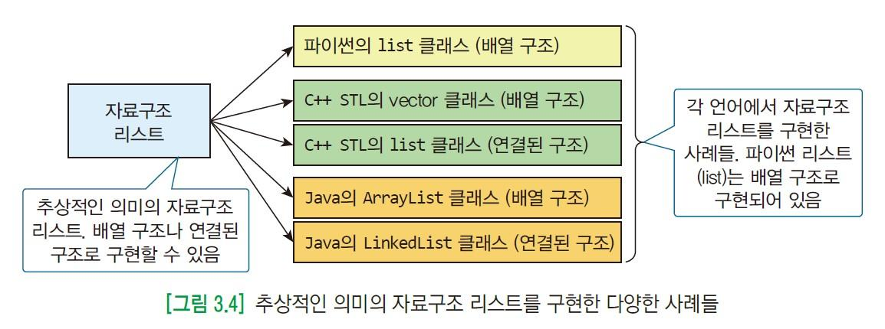
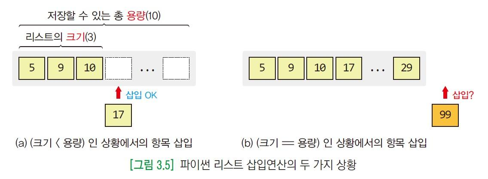
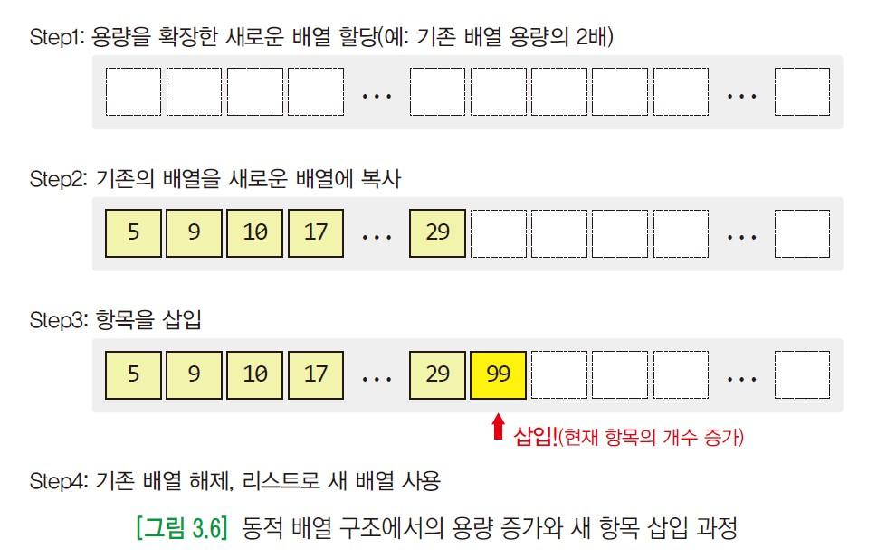
  
---

### 10. 집합(set)

- 원소의 중복 허용하지 않음
- 원소들 사이에 순서가 없음

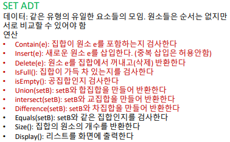
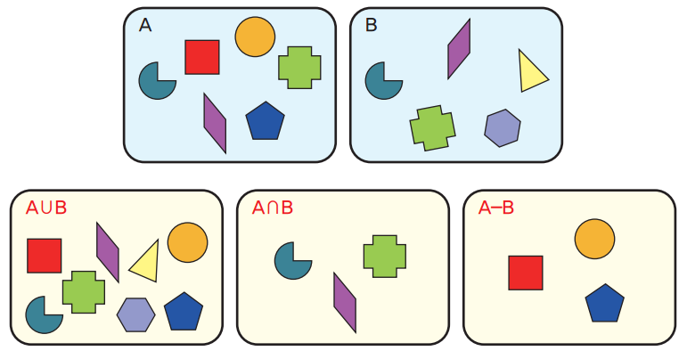

## 💡 느낀 점