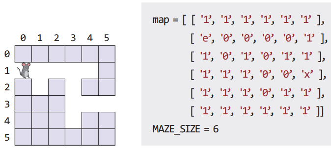
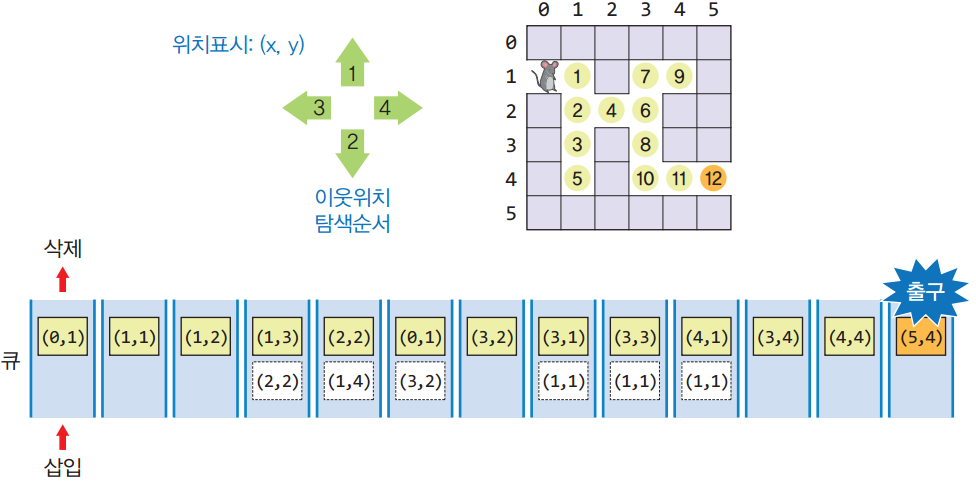
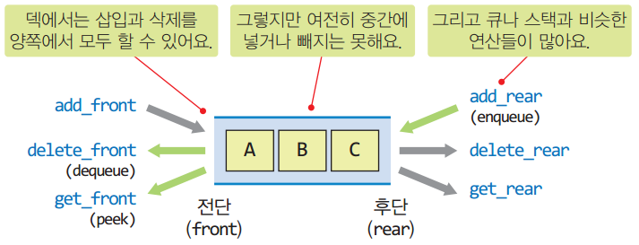

# 📅 2026-04-30 - 자료구조

## 📚 상세 학습 내용

### 1. 집합 구현 방법

- 파이썬을 이용한 집합 ADT(함수, 클래스로 구현)

- SET ADT
  - 데이터: 같은 유형의 유일한 요소들의 모임. 원소들은 순서는 없지만
  - 서로 비교할 수 있어야 함
- 연산
  - Contain(e): 집합이 원소 e를 포함하는지 검사한다
  - Insert(e): 새로운 원소 e를 삽입한다. (중복 삽입은 허용안함)
  - Delete(e): 원소 e를 집합에서 꺼내고(삭제) 반환한다
  - IsFull(): 집합이 가득 차 있는지를 검사한다
  - isEmpty(): 공집합인지 검사한다
  - Union(setB): setB와 합집합을 만들어 반환한다
  - intersect(setB): setB와 교집합을 만들어 반환한다
  - Difference(setB): setB와 차집합을 만들어 반환한다
  - Equals(setB): setB와 같은 집합인지를 검사한다
  - Size(): 집합의 원소의 개수를 반환한다
  - Display(): 리스트를 화면에 출력한다

### 2. 파이썬 큐 모듈

- queue 모듈
  - import queue
- 큐, 스택 클래스 제공

```python
import queue
#maxsize = 0: 무한대 크기
Q = queue.Queue(maxsize = 20)
for v in range(1, 10) :
Q.put(v)
print("큐의 내용: ", end=‘’)
for _ in range(1, 10) :
print(Q.get(), end=' ')
print()
```

```python
S = queue.LifoQueue(maxsize = 20)
for v in range(1, 10) :
S.put(v)
print("큐의 내용: ", end='')
for _ in range(1, 10) :
print(S.get(), end=' ')
print()
```

- 큐가 공백상태일때, get() 함수를 사용한다면?
- Maxsize 이상의 항목을 put() 함수로 입력한다면?
- 무한루프?
- empty(), full() 필요?


### 3. 큐 응용

- 미로 탐색(넓이 우선 탐색)




### 4. 덱(deque, double-ended queue)

- 큐의 전단과 후단 모두에서 삽입과 삭제가 가능한 큐
  - 스택이나 큐보다 입출력이 자유로운 구조
  - 스택이나 큐로 사용
- 중간에 삽입하거나 삭제하는 것은 허용하지 않음




## 💡 느낀 점