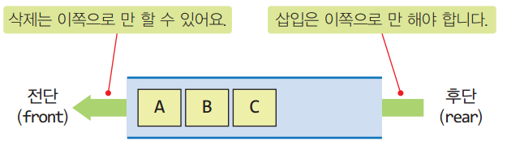
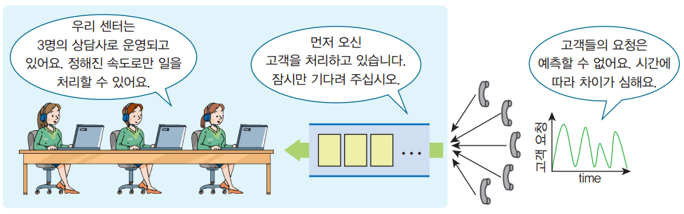

# 📅 2026-05-06 - 자료구조 (복습)

## 📚 상세 학습 내용

### 1. 자료 구조(data structure)

### 1. 선형 자료구조
- 선형 자료구조는 데이터가 한줄로 연결되어 있는 구조입니다.
  앞뒤 순서가 있는 자료구조임

### 1. 자료구조(data structure)

- 컴퓨터에서 자료들을 정리하고 조직화 하는 여러가지 구조
- 단순 자료 구조: 숫자, 문자
- 복합 자료 구조 : 여러 자료들을 한꺼번에 보관 (컨테이너(container))

### 2. 큐(queue)

- 선입선출(FIFO, First-In Frist-Out) 형태의 자료구조
- 큐 후단(rear)에서 삽입, 삭제는 전단(front)에서 수행하는 구조

    
    

### 3. 큐 활용 예

- 버퍼(buffer) , 콜 큐(call queue)
- 인쇄 작업 큐
- 버퍼링(buffering)
  - 실시간 비디오 스트리밍
- 시뮬레이션
  - 은행 대기표
  - 공항 비행기 활주로 이용
  - 인터넷 데이터 패킷 모델링

    

### 4. 큐 구현 방법(선형 큐)

- 파이썬을 이용한 큐 ADT
  - 오버플로(overflow), 언더플로(underflow) 주의

## 💡 느낀 점