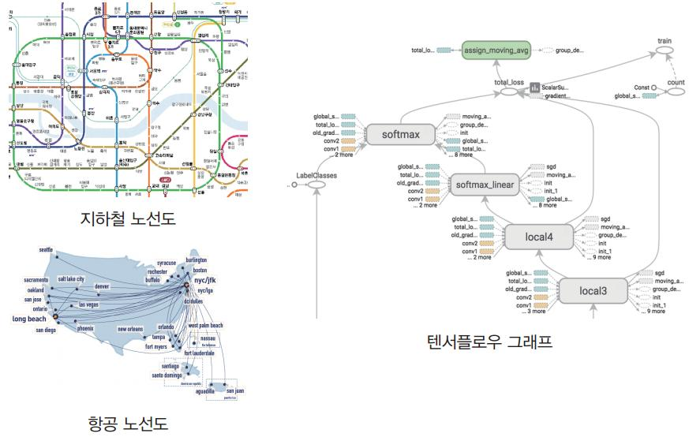
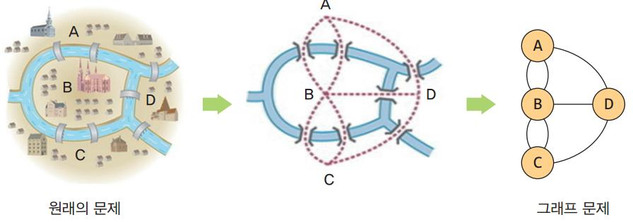

# 자료구조 그래프 정리 (147페이지 이후)

> 기준: 업로드한 강의자료의 **그래프 파트(147페이지 이후)** 중심 요약  
> 참고: 147페이지는 그래프 단원 시작 페이지이며, 실제 핵심 내용은 다음 페이지들에서 이어집니다.

> 아래 이미지는 사용자가 업로드한 PDF의 관련 페이지를 발췌한 참고 이미지입니다.
> 파일 경로 기준으로 같은 폴더의 `graph_images/` 이미지를 참조합니다.

---

## 1. 그래프(Graph)란?



> 출처: 업로드한 수업자료 PDF p.148 그래프 소개 화면


그래프는 **정점(Vertex)** 과 **간선(Edge)** 으로 이루어진 자료구조이다.

- **정점(vertex, node)**: 데이터를 나타내는 점
- **간선(edge, link)**: 정점 사이의 관계를 나타내는 선
- 보통 다음과 같이 표현한다.

```text
G = (V, E)
```

- `V`: 정점의 집합
- `E`: 간선의 집합

### 왜 쓰는가?
트리보다 더 일반적인 관계를 표현할 수 있기 때문이다.

예:
- 지하철 노선
- 도로 연결
- SNS 친구 관계
- 선수과목 관계

---

## 2. 그래프의 역사적 배경: 오일러 문제



> 출처: 업로드한 수업자료 PDF p.149 오일러 문제 설명


그래프 이론의 대표적 시작 사례는 **쾨니히스베르크의 다리 문제**이다.

### 핵심 질문
- 모든 다리를 **한 번씩만** 건너 원래 위치로 돌아올 수 있는가?

이 문제를
- 땅 = 정점
- 다리 = 간선

으로 바꾸어 생각하면서 그래프 개념이 탄생했다.

### 오일러 경로 / 오일러 회로
- **오일러 경로**: 모든 간선을 정확히 한 번씩 지나는 경로
- **오일러 회로**: 모든 간선을 정확히 한 번씩 지나고 시작점으로 되돌아오는 경로

### 기억 포인트
- 모든 정점의 차수가 짝수이면 오일러 회로가 존재할 수 있다.

---

## 3. 그래프의 종류


> 출처: 업로드한 수업자료 PDF p.151 무방향/방향 그래프


> 출처: 업로드한 수업자료 PDF p.152 가중치 그래프/부분 그래프


### 3-1. 무방향 그래프 (Undirected Graph)
간선에 방향이 없다.

- `(A, B) = (B, A)`
- 양방향 연결 의미

예: 친구 관계

### 3-2. 방향 그래프 (Directed Graph, Digraph)
간선에 방향이 있다.

- `<A, B> ≠ <B, A>`
- 한쪽 방향만 의미할 수 있음

예: 선수과목, 팔로우 관계

### 3-3. 가중치 그래프 (Weighted Graph)
간선마다 값이 붙어 있는 그래프

예:
- 거리
- 비용
- 시간

### 3-4. 부분 그래프 (Subgraph)
원래 그래프의 일부 정점/간선만 뽑아 만든 그래프

---

## 4. 기본 용어


> 출처: 업로드한 수업자료 PDF p.153 인접 정점, 차수


> 출처: 업로드한 수업자료 PDF p.154 경로, 단순 경로, 사이클


### 인접 정점 (Adjacent Vertex)
간선으로 직접 연결된 정점

### 차수 (Degree)
한 정점에 연결된 간선의 개수

#### 무방향 그래프
- 정점의 차수 = 연결된 간선 수
- **모든 정점의 차수 합 = 2 × 간선 수**

#### 방향 그래프
- **진입 차수(in-degree)**: 들어오는 간선 수
- **진출 차수(out-degree)**: 나가는 간선 수
- 전체 진입 차수 합 = 전체 진출 차수 합 = 간선 수

### 경로 (Path)
간선을 따라 이동하는 정점의 순서

### 경로 길이
경로에 포함된 간선의 수

### 단순 경로 (Simple Path)
같은 간선을 반복하지 않는 경로

### 사이클 (Cycle)
시작 정점과 끝 정점이 같은 경로

---

## 5. 특수한 그래프


> 출처: 업로드한 수업자료 PDF p.155 연결 그래프, 트리, 완전 그래프


### 연결 그래프 (Connected Graph)
모든 정점 사이에 경로가 존재하는 그래프

### 트리 (Tree)
사이클이 없는 연결 그래프

특징:
- 임의의 두 정점 사이 경로가 하나뿐
- 매우 중요한 그래프의 특수 형태

### 완전 그래프 (Complete Graph)
모든 정점이 서로 연결된 그래프

정점 수가 `n`개인 무방향 완전 그래프의 간선 수:

```text
n(n-1)/2
```

---

## 6. 그래프 표현 방법


> 출처: 업로드한 수업자료 PDF p.157 인접 행렬


> 출처: 업로드한 수업자료 PDF p.158 인접 리스트


그래프는 보통 두 가지 방법으로 구현한다.

### 6-1. 인접 행렬 (Adjacency Matrix)
정점 사이 연결 여부를 2차원 배열로 저장

#### 예시 개념
- 연결되어 있으면 `1`
- 없으면 `0`

#### 장점
- 두 정점이 연결되었는지 확인이 빠름
- `O(1)`에 확인 가능

#### 단점
- 공간을 많이 씀
- 정점이 `n`개면 `n^2` 공간 필요

#### 적합한 경우
- 간선이 많은 **조밀 그래프(dense graph)**

---

### 6-2. 인접 리스트 (Adjacency List)
각 정점마다 연결된 정점들을 리스트로 저장

#### 장점
- 공간 효율이 좋음
- 희소 그래프에 유리

#### 단점
- 특정 간선 존재 확인은 느릴 수 있음

#### 적합한 경우
- 간선이 적은 **희소 그래프(sparse graph)**

---

## 7. 인접 행렬 vs 인접 리스트 비교


> 출처: 업로드한 수업자료 PDF p.159 표현 방식 비교표


| 항목 | 인접 행렬 | 인접 리스트 |
|---|---|---|
| 공간 복잡도 | `O(n^2)` | `O(n+e)` |
| 간선 존재 확인 | 빠름 | 상대적으로 느림 |
| 희소 그래프 | 비효율적 | 유리 |
| 조밀 그래프 | 유리 | 보통 |

### 한 줄 요약
- **간선이 많다 → 인접 행렬**
- **간선이 적다 → 인접 리스트**

---

## 8. 그래프 탐색


> 출처: 업로드한 수업자료 PDF p.163 그래프 탐색 소개


그래프 탐색은 시작 정점에서 출발하여 모든 정점을 방문하는 과정이다.

대표 방법은 두 가지:

1. **DFS** (깊이 우선 탐색)
2. **BFS** (너비 우선 탐색)

---

## 9. DFS (Depth First Search)


> 출처: 업로드한 수업자료 PDF p.164 DFS 설명 및 코드 예시


한 방향으로 **끝까지 깊게** 들어가는 탐색 방법

### 특징
- 재귀 또는 스택 사용
- 갈 수 있을 때까지 계속 감
- 막히면 되돌아옴

### 시간 복잡도
- 인접 리스트 기준: `O(n+e)`
- 인접 행렬 기준: `O(n^2)`

### 기억법
- **깊게 먼저**
- 스택 / 재귀

---

## 10. BFS (Breadth First Search)


> 출처: 업로드한 수업자료 PDF p.165 BFS 설명 및 코드 예시


시작 정점에서 가까운 정점부터 차례대로 방문하는 탐색 방법

### 특징
- 큐(queue) 사용
- 레벨 순서대로 탐색

### 시간 복잡도
- 인접 리스트 기준: `O(n+e)`
- 인접 행렬 기준: `O(n^2)`

### 기억법
- **가까운 곳부터**
- 큐 사용

---

## 11. DFS와 BFS 차이


> 출처: 업로드한 수업자료 PDF p.164~165 DFS/BFS 비교 참고


| 구분 | DFS | BFS |
|---|---|---|
| 탐색 방향 | 깊게 | 넓게 |
| 자료구조 | 스택 / 재귀 | 큐 |
| 특징 | 한 경로를 끝까지 탐색 | 가까운 정점부터 탐색 |
| 활용 | 백트래킹, 경로 탐색 | 최단 단계 탐색 |

---

## 12. 연결 성분 (Connected Component)


> 출처: 업로드한 수업자료 PDF p.166 연결 성분 개념


서로 연결되어 있는 정점들의 최대 부분 그래프

### 찾는 방법
- DFS 또는 BFS를 수행
- 아직 방문하지 않은 정점에서 다시 탐색 시작
- 탐색을 새로 시작할 때마다 새로운 연결 성분 1개

---

## 13. 신장 트리 (Spanning Tree)


> 출처: 업로드한 수업자료 PDF p.168 신장 트리 설명


그래프의 모든 정점을 포함하는 트리

### 조건
- 모든 정점을 포함
- 사이클이 없음
- 정점이 `n`개이면 간선은 `n-1`개

### 의미
원래 그래프의 연결은 유지하면서 간선 수를 최소화한 구조

---

## 14. 위상 정렬 (Topological Sort)


> 출처: 업로드한 수업자료 PDF p.169 위상 정렬 개념


> 출처: 업로드한 수업자료 PDF p.170 위상 정렬 절차


방향 그래프에서 선후 관계를 지키며 정점을 나열하는 방법

### 조건
- **사이클이 없어야 함**
- 즉, **DAG(Directed Acyclic Graph)** 이어야 함

### 기본 원리
1. 진입 차수가 0인 정점을 선택
2. 그래프에서 제거
3. 새롭게 진입 차수 0이 된 정점을 선택
4. 반복

### 활용
- 선수과목 순서
- 작업 스케줄링
- 빌드 순서

---

## 15. 시험 대비 핵심 암기 포인트


> 출처: 업로드한 수업자료 PDF p.171 구현 예시. 마지막 암기 포인트 정리 시 함께 참고 가능


- 그래프: `G = (V, E)`
- 무방향 그래프: `(A, B) = (B, A)`
- 방향 그래프: `<A, B> ≠ <B, A>`
- 무방향 그래프의 차수 합 = `2 × 간선 수`
- 완전 그래프 간선 수 = `n(n-1)/2`
- 트리 = 사이클 없는 연결 그래프
- 신장 트리의 간선 수 = `n-1`
- DFS = 깊게 / 스택 / 재귀
- BFS = 넓게 / 큐
- 위상 정렬 = 진입 차수 0부터 제거
- 위상 정렬은 사이클이 있으면 불가능

---

## 16. 그림 자료(저작권 표기 포함)

아래 그림은 **Wikimedia Commons**의 저작권·라이선스 정보가 확인되는 자료를 참조한 것이다.

### 그림 1. 완전 그래프 K5 예시


> 출처: Wikimedia Commons, *File:Complete Graph K5.svg*  
> 라이선스: Public domain (저작권 비보호/퍼블릭 도메인)  
> 참조: https://commons.wikimedia.org/wiki/File:Complete_Graph_K5.svg

이 그림은 **완전 그래프**의 대표 예시다. 정점 5개가 모두 서로 연결되어 있다.

---

### 그림 2. DFS(깊이 우선 탐색) 시각화 예시


> 출처: Wikimedia Commons, *File:Depth first search.svg*  
> 라이선스: CC BY-SA 4.0  
> 참조: https://commons.wikimedia.org/wiki/File:Depth_first_search.svg

이 그림은 DFS가 **한 경로를 깊게 따라간 뒤 되돌아오는 방식**임을 이해할 때 도움이 된다.

---

## 17. 초압축 요약

- 그래프는 **정점 + 간선**으로 관계를 표현하는 자료구조
- 종류: 무방향 / 방향 / 가중치 그래프
- 핵심 용어: 차수, 경로, 사이클, 연결 그래프
- 구현: 인접 행렬 / 인접 리스트
- 탐색: DFS / BFS
- 응용: 연결 성분, 신장 트리, 위상 정렬

---

## 참고 출처

1. Wikimedia Commons, *File:Complete Graph K5.svg*  
2. Wikimedia Commons, *File:Depth first search.svg*
